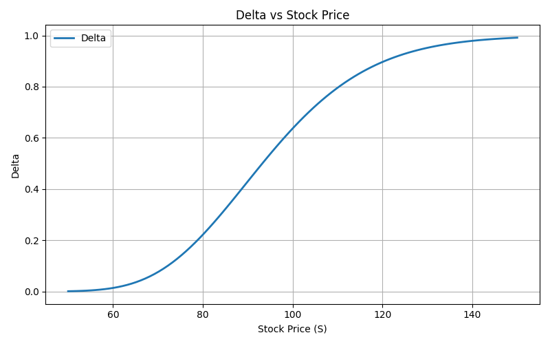

# 📈 Options Pricing, Greeks Calculator & Monte Carlo Simulation

## ✅ **Project Overview**
This project implements:
- Black-Scholes Model for European Call & Put options pricing
- Calculation of **Greeks** (Delta, Gamma, Vega, Theta, Rho)
- **Sensitivity Plots** for Greeks
- **Monte Carlo Simulation** for pricing options
- Complete results summary

Designed as a **Quant Finance Project** for deep understanding of options and risk measures.

---

## 🛠 **Technologies Used**
- Python 3
- NumPy
- SciPy
- Matplotlib
- Pandas (Optional for extension)

---

## 📂 **Project Structure**
```
Options-Pricing-Greeks/
├── bs_model.py                  # Black-Scholes pricing functions
├── greeks_calculator.py         # Greeks calculations
├── plot_greeks.py               # Sensitivity plots (Greeks)
├── monte_carlo.py               # Monte Carlo simulation
├── plots/                       # Contains all generated plots
│    ├── delta_plot.png
│    ├── gamma_plot.png
│    ├── vega_plot.png
│    ├── theta_plot.png
│    └── rho_plot.png
├── results_summary.md           # Detailed results and analysis
└── README.md                    # Project documentation
```

---

## ✅ **How to Run the Project**
1. Install dependencies:
```bash
pip install numpy scipy matplotlib
```

2. Run Black-Scholes Pricing:
```bash
python bs_model.py
```

3. Calculate and Validate Greeks:
```bash
python greeks_calculator.py
```

4. Generate Greeks Sensitivity Plots:
```bash
python plot_greeks.py
```

5. Run Monte Carlo Simulation:
```bash
python monte_carlo.py
```

---

## 📊 **Example Output - Black-Scholes Pricing**
| Metric      | Value   |
|------------ |--------:|
| Call Price  | 10.4506 |
| Put Price   | 5.5735  |

---

## 🖼 **Sample Greeks Plots**

*(Add actual plot images if uploading to GitHub)*

---

## 🔥 **Key Learnings**
- Options Pricing using Black-Scholes Model
- Importance of Greeks in risk measurement
- Monte Carlo simulation for complex derivative pricing
- Data visualization of risk sensitivities

---

## 📈 **Next Module (Upcoming):**
✅ Portfolio Optimization & Efficient Frontier

---

## ✨ **Author**
Niraj Patil — Quant Finance & Data Science Enthusiast

---

## ⭐ **License**
Open-source, for learning and portfolio building.
```
